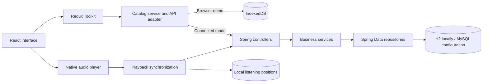

# Architecture

[Project overview](../README.md) · [Case study](review.md) · [API](api.md) · [Security](security.md)

AudioLibrary separates interaction, application state, business rules and persistence. The same React interface supports a device-local demo and an authenticated backend, with the difference handled by service modules.

## System overview

## Frontend boundaries

| Layer      | Responsibility                                                       | Entry point                          |
| ---------- | -------------------------------------------------------------------- | ------------------------------------ |
| Components | Forms, feedback, catalog and audio controls                          | [App.tsx](../frontend/src/App.tsx)   |
| State      | Catalog request lifecycle, selected track and playback state         | [store](../frontend/src/store)       |
| Hooks      | Catalog loading, progress hydration and synchronization              | [hooks](../frontend/src/hooks)       |
| Services   | API contract translation, authenticated requests and browser storage | [services](../frontend/src/services) |

Components receive typed data and callbacks. Async catalog operations run through Redux Toolkit thunks. The API adapter translates the backend's Italian field names into the frontend's `AudioTrack` model, keeping transport details out of presentation components.

The audio element emits playback events. Redux retains the selected story, playing state and whole-second position. Request identifiers prevent a late catalog response from restoring stale state after the account session changes.

## Backend boundaries

| Layer             | Responsibility                                            | Source                                                                                                                              |
| ----------------- | --------------------------------------------------------- | ----------------------------------------------------------------------------------------------------------------------------------- |
| Controllers       | Request validation, HTTP responses and DTO mapping        | [controller](../backend/src/main/java/com/ingswpf/audiolibrarybe/controller)                                                        |
| Services          | Ownership, visibility, sharing and listening rules        | [service](../backend/src/main/java/com/ingswpf/audiolibrarybe/service)                                                              |
| Repositories      | Parameter-bound database operations                       | [repository](../backend/src/main/java/com/ingswpf/audiolibrarybe/repository)                                                        |
| Entities and DTOs | Persistent relationships and explicit API representations | [model](../backend/src/main/java/com/ingswpf/audiolibrarybe/model) · [dto](../backend/src/main/java/com/ingswpf/audiolibrarybe/dto) |

Constructor injection makes required dependencies explicit. Audiobook mutations use transactions so a failed multi-recipient sharing request cannot leave a partially updated database. DTOs expose the response contract without serializing password fields or arbitrary entity relationships.

Entity equality uses persistent identifiers and stable hash codes. Collections are initialized when entities are created, making new entities safe to map and modify before a reload from the database.

## Patterns and their purpose

| Pattern              | Use in this project                                              | Benefit                                                       |
| -------------------- | ---------------------------------------------------------------- | ------------------------------------------------------------- |
| Layered architecture | Controllers, services and repositories                           | Business rules can be reviewed independently of HTTP handling |
| Adapter              | Frontend services translate backend DTOs                         | UI models remain independent of endpoint naming               |
| Strategy             | Owned, network and favorite catalogs; title/date search variants | Existing selection behaviors remain explicit                  |
| DTO mapping          | Dedicated request and response models                            | Transport validation and persistence have separate contracts  |
| Dependency injection | Constructor-injected backend collaborators                       | Dependencies are visible and replaceable in tests             |

The existing DTO builders remain for compatibility. New behavior is added to the layer that owns it, without introducing an additional abstraction for every operation.

## Media flow

**Browser demo:** upload validation → file reading → IndexedDB write → catalog update. Audio avoids the small, synchronous localStorage quota. Valid entries from the earlier localStorage catalog are imported once.

**Connected mode:** validated base64 upload → authenticated controller → transactional service → database. Catalog requests use `metadataOnly=true`; selecting a stored story retrieves its media through an authenticated endpoint. The player releases temporary object URLs when the selection changes.

Metadata-only responses reduce encoding and network transfer. Binary columns remain in JPA entities, so this does not establish lazy database loading or constant-memory streaming. The frontend currently downloads the selected file as a complete Blob before playback.

## Playback consistency

1. Load the catalog and compare the latest local position with timestamped remote listening records.
2. Hydrate state before enabling persistence, then restore the audio position after metadata loads.
3. Save whole-second positions locally, scoped by API URL, account and track.
4. Serialize remote writes every five seconds while playing, on pause and when the page becomes hidden.

The queue preserves write order within a client. Concurrent devices follow server arrival order; there is no merge protocol or offline retry queue. A tab closing can interrupt the last remote request, while its most recently saved local position remains available in that browser.

## Extension points

| Next step                              | Current boundary                                   | Intended improvement                                     |
| -------------------------------------- | -------------------------------------------------- | -------------------------------------------------------- |
| Catalog pagination                     | Catalog lists are returned together                | Bound query, response and rendering work                 |
| Separate media storage                 | Binary content lives in database entities          | Scale media independently and support streaming delivery |
| MySQL migrations and integration tests | H2 is the tested local environment                 | Validate production schema changes and dialect behavior  |
| Account lifecycle features             | Registration, login and logout are implemented     | Add recovery, rate limits and expired-session cleanup    |
| Management screens                     | Sharing, favorites and visibility exist in the API | Expose the remaining backend capabilities in the UI      |

The backend currently targets Spring Boot 3.5.16, retaining the Jackson 2 integration during the migration from 2.7. Framework support and security updates should be evaluated before public deployment. Detailed authentication and deployment constraints are in the [security guide](security.md).
